<h1 align="center"> proxphish </>

<h2 align="center">
proxphish is a advanced phishing tool 
</h2>

  

   

 

     
 

 
<h3> Easy Install </h3> 
Open a terminal with root permissions and run this command:   
bash <(curl -s https://raw.githubusercontent.com/makdosx/proxphish/main/__ROOT__/install.txt)    

<h5> Make the necessary settings that you will see during the installation, so that everything is automatic and no later settings are needed manually</h5>

After install find proxphish DNS, PANEL and WEB in applications menu  
For Kali Linux find it in Kali Menu -> Exploitation Tools  

 <h2> Install and use proxphish (video) </h2> 

[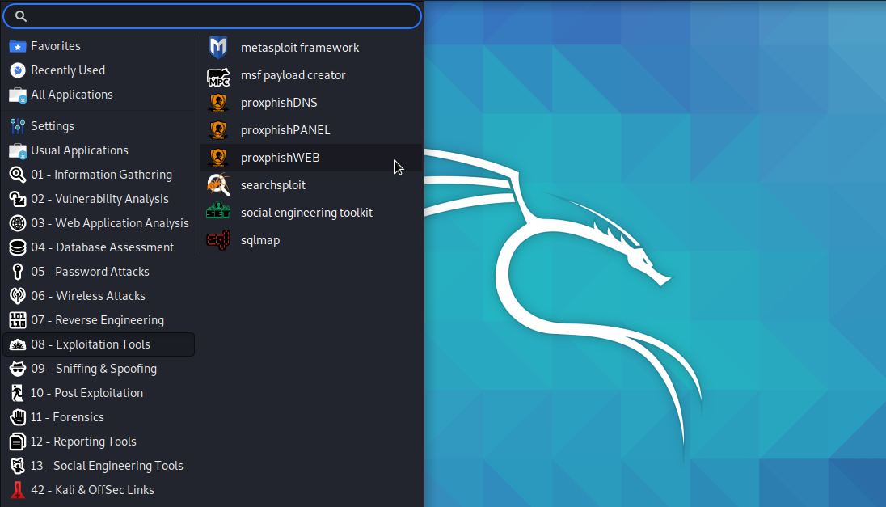](https://www.youtube.com/watch?v=Ev498REzUWo "proxphish example")    
 

Pre-installed Cloned Services   

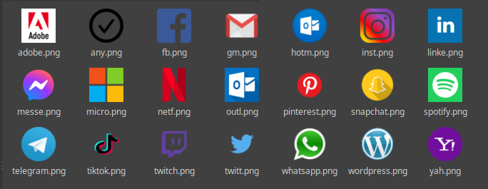    

   Details  

For cloning the e-services  
i) Custom default templates for social media, emails, clouds, computer companies and other e-services  
ii) Any template with manual method for cloning e -services   

For sending phishing emails  
i) Auto method with smtp local server  
   a) Ngrok link for fake dns </b>
   b) Any fake dns with other srvice e.x server  
   c) Your ip from server. Recommended not try this. If try this method use one vpn and port forward on your router    
 
   
   
  <b> Specifications </b>   
 
  <table>
 
  <tr>
     <td>  </td>
  <td> System requirements (dual core and more, 2gb ram and more) </td>
   </tr>
   
  <tr>
   <td>  </td>
   <td>  OS System: (Gnu/linux systems bellow) </td>
  </tr>
  
 <tr>
  <td>  </td>
  <td> Kali Linux </td>
 </tr>
     
 <tr>
  <td>  </td>
  <td> Ubuntu </td>
 </tr>

<tr>
 <td>  </td>
 <td> Linux Mint </td>
</tr>

</table> </br  

 Manual install and use 

i) Open the file settings.php and give username and password of your mail account for sending the phishing mails.  
   Notice! Use a Vpn when creating and using email  
   Notice! The programm using gmail accounts for sending email  
   Notice! If using another mail service account set the parameters for smtp protocol,host and security in dns.php file at mail phishing paragraph    
   
  
ii) Go to folder /var/www/proxphish/ngrok/ open a terminal and setup the ngrok account  
    After using the ngrok for ceate fake dns. open application proxphishDNS  
    Notice! For as long as the attack lasts do not close the terminal with the warm because the dns will be lost  
    Notice! In every attack close and run again the ngrok for creation new fake dns and for hide your identity  
    
    
  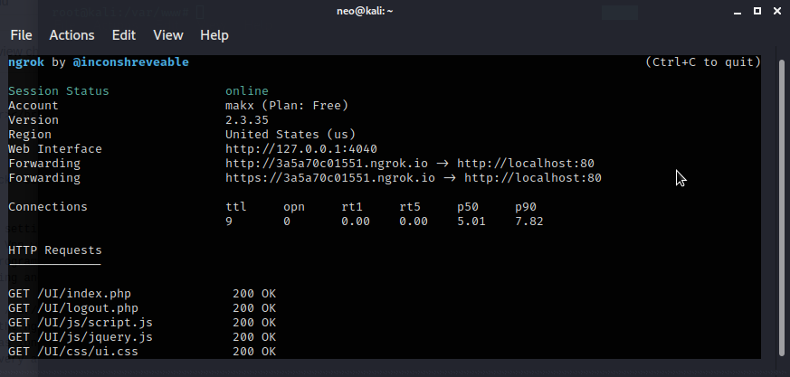    
    
   
iii)  Open application proxiphishWEB. Welcome to proxphish program. Happy hacking!  
      For delete cloning e-service and attack from begin with anaother e-service clear the program  
      Manual Clear Method  
      local Ipv4/clear.php e.x 192.168.2.2/clear.php. Wait litle second and will be transfer automate in new clear environment.  
        
      Notice! If at some point during the attack you get the message "Phishing attack failed" then it means that you have exceeded the limit of daily emails and                 your smtp server cuts you.
      In this case, just use a new gmail account   
    
    
  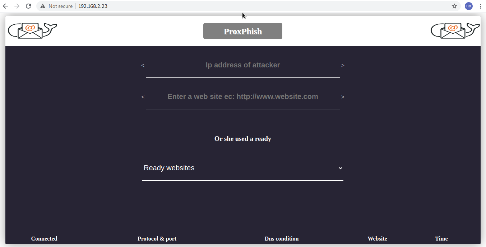      
  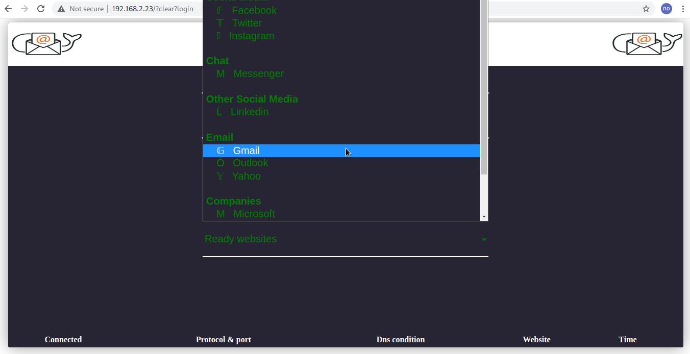    
  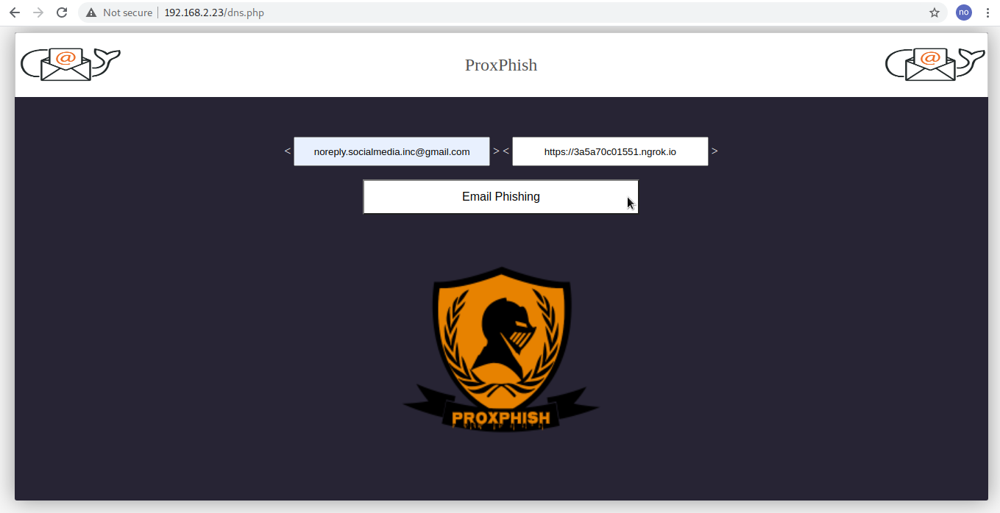    
  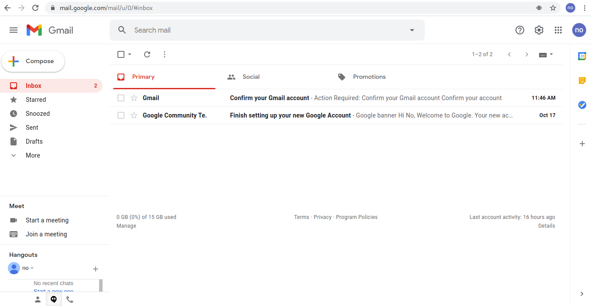    
  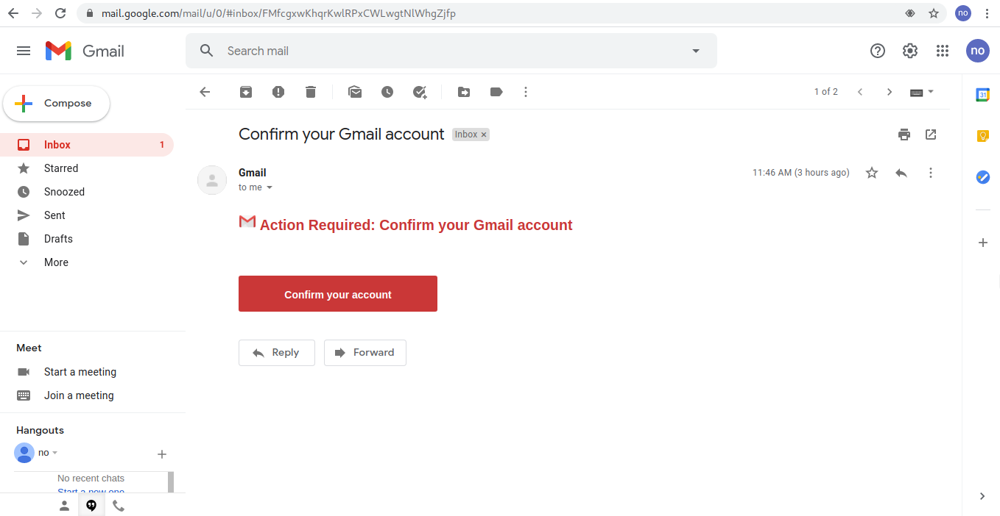    
  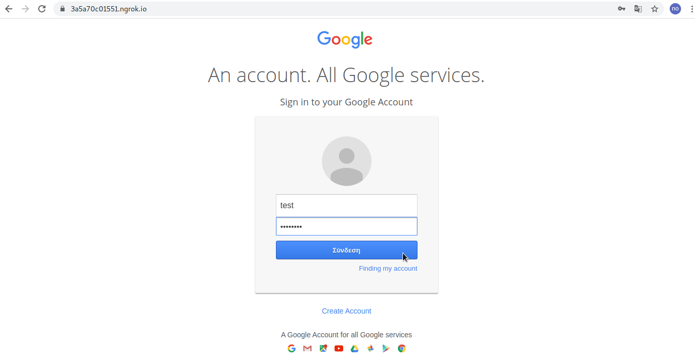    
  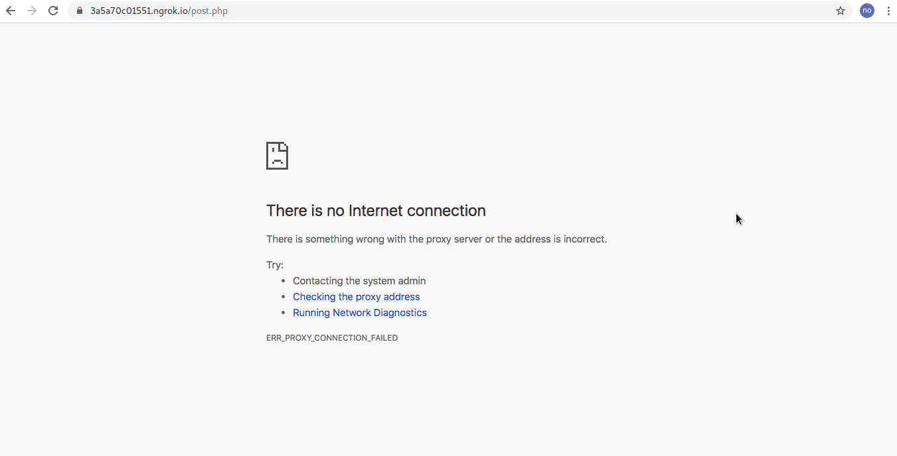    

 Acces to the Control Panel of proxphish 

i) Open the application proxiphishPANEL  
   Login Credentials: username: proxphish@dns password: proxphish@dns  
   For this panel see you the hacked account   
   In this panel you view the hacked accounts, and many other operations such as (data storage, deletion, and attack from begin).   
   
 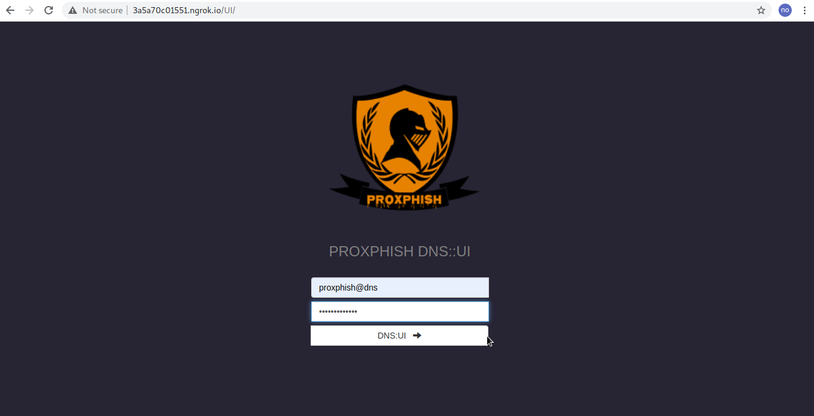    
 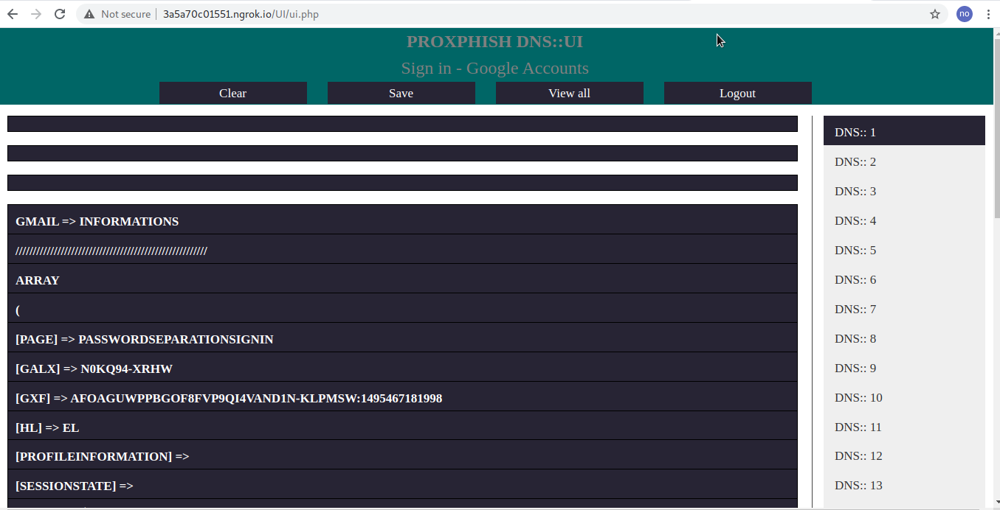    
 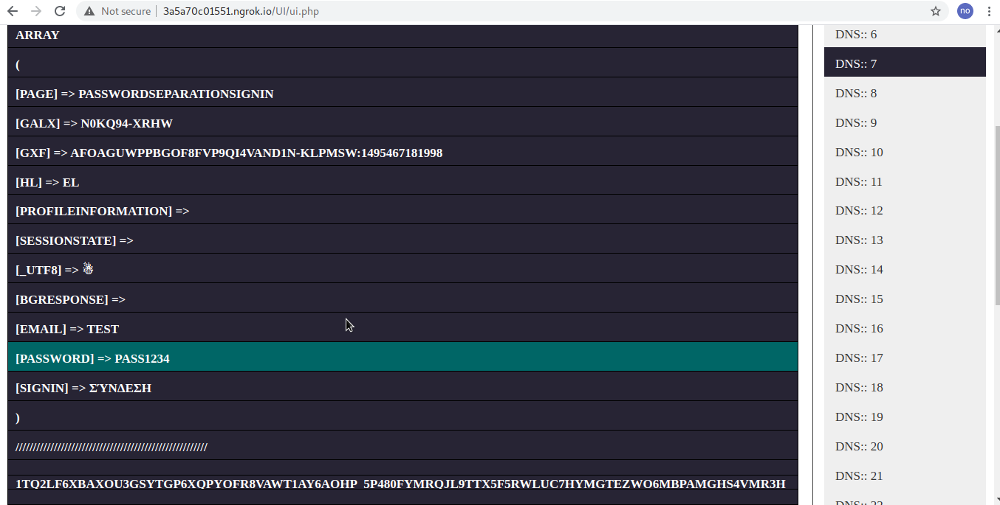   

